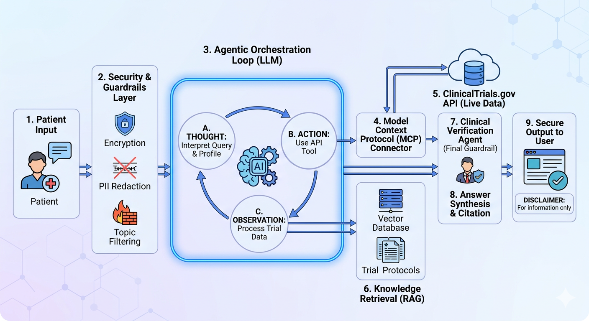

# OncoMatch AI
## Agentic Clinical Trial Discovery & Eligibility Tool

### Overiew
OncoMatch AI is an intelligent reasoning system designed to bridge the gap between complex clinical trial data and cancer patients. Unlike standard search tools, this platform utilizes an **Agentic Orchestration Loop** to interpret patient medical profiles and query live clinical data, providing personalized, pre-verified eligibility insights through natural language. Combines structured filtering with LLM-assisted search to make trial discovery accessible for families and caregivers.

## System Architecture
The system follows a modular, security-first pipeline as visualized in our process diagram:

<p align="center">

</p>

**Zero-Trust Security & Guardrails**
+ PII/PHI Redaction: Automatic stripping of personally identifiable information before data reaches the LLM.
+ Topic Filtering: Hard-coded constraints to prevent non-clinical queries and prompt injection.

**The Agentic Orchestration Loop (Core Engine)**
The heart of the system is an autonomous reasoning agent operating on a Thought → Action → Observation (TAO) loop:
- Thought: The LLM analyzes the patient query (e.g., "Stage III NSCLC") and determines what missing data points (biomarkers, age, location) are needed.
- Action: The agent utilizes a Model Context Protocol (MCP) connector to perform live API calls to ClinicalTrials.gov.
- Observation: The agent ingests raw JSON data from the trial registry and iterates if further refinement is required.

**Hybrid Retrieval Strategy (RAG)**
- Live API Retrieval: Fetches real-time trial statuses, recruitment updates, and location-based data.
- Vector Database RAG: Utilizes a vector store (e.g., ChromaDB/SQLit-vss) containing high-density Trial Protocol - Documents. This allows the agent to check deep inclusion/exclusion criteria that are often buried in 100+ page PDFs.

**Clinical Verification & Safety**
- Multi-Agent Verification: A secondary "Critic" agent cross-references the synthesized output against the source trial NCT IDs to eliminate hallucinations.
- Traceable Citations: Every claim made to the user is backed by a direct link to the official study record.

**Ethical & Medical Guardrails**
- Non-Diagnostic: The system is strictly an informational tool. It does not provide medical advice or treatment recommendations.
- Human-in-the-Loop: Designed to generate a "Clinical Trial Summary Report" that a patient can take directly to their oncologist for professional review.


## Fetching Clinical Trials Data

This project uses the ClinicalTrials.gov v2 API to fetch pediatric brain tumor trials updated in the last 12 months.

To fetch and parse your own data:

```bash
python ingest/test_parse.py
```

# Installations: Using Ollama, LangChain with a Virtual Environment
1. Install Ollama (System-wide)
Ollama runs as a background service, not inside virtual environment. Install it once on your system:
`curl -fsSL https://ollama.com/install.sh | sh`

2. Pull a Model (Mistral or Phi-3 or llama3) depending on your compute resources and use case. I will istall the lightwieght model, Phi-3. It is smaller in size compared to other models with 4.2B parameters and has quantized versions, utilizing 4-8GB RAM.
`ollama pull phi3`

To check model's metadata (model size, architecture, quantization info)
`ollama show phi3`

To test the model
`ollama run phi3`
and type a question "Eg. What is the currency of France?"

3. Activate Your Virtual Environment and then install LangChain and the Ollama integration:
`conda activate env_name`
`pip install langchain langchain-community`